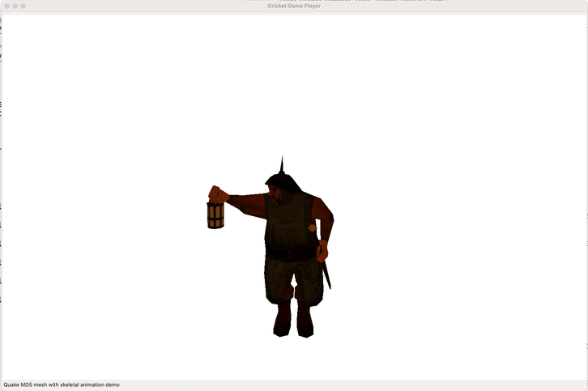

This is a prototype implementation of parsing and viewing Quake MD5 meshes with skeletal animations
and Wavefront meshes with vertex animation.

This implementation depends upon [Lispworks OpenGL
bindings](http://www.lispworks.com/documentation/lw51/RNIG/html/readme-274.htm)

A sample 3D asset is provided in assets/bob folder. The following are the instructions to view this 
sample MD5 mesh.

Prerequisites
-------------

I have testd this only with Lispworks 6.0 and Lispworks 8.0, the latter which I am using now. You
should use Lisworks 8.0 if you are running this on Apple Silicon.

I haven't tested this on Windows/Linux platforms but it should most likely work on these platforms
as well.

Running the demo
----------------

1. Start Lispworks.

2. In the listenera, load the Lispworks OpenGL bindings. Ensure the path to your Lispworks
installation is correct.

```
 (load "/Applications/LispWorks\ 8.0\ \(64-bit\)/Library/lib/8-0-0-0/examples/opengl/load")
```

3. Clone this repo to your `quicklisp/local-projects`.

4. In the listener, now load this project.

```
(ql:quickload :cl-game-models)
```

5. To run the demo, eval this form in the listener.
```
(cl-game-models:demo-scene)
```

You will see the bob animation playing in an Lispworks OpenGL pane.



About License
-------------

Please note that the sample asset provided under `assets/bob/` folder is
copyrighted. Please note that the [license](./assets/bob/bob.source.txt) for this asset are
independent of the license of this repository and you must reproduce the asset license as well. 
